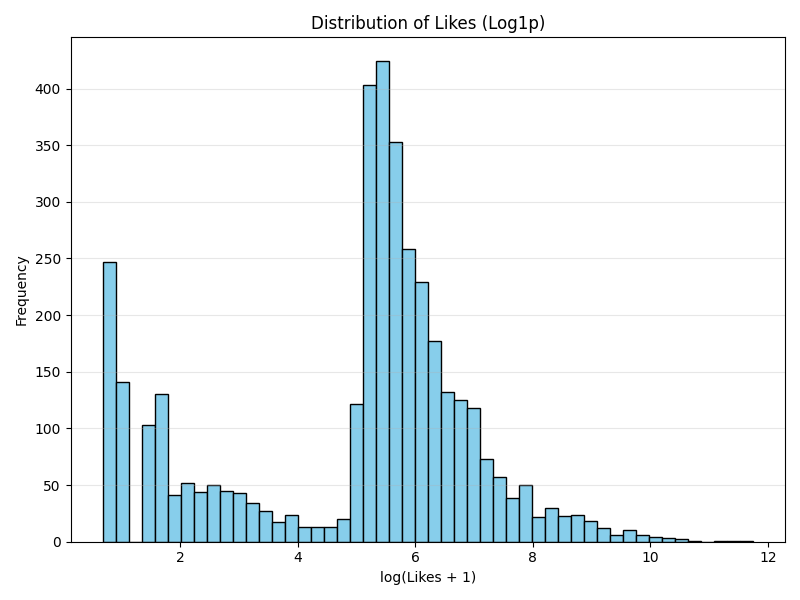
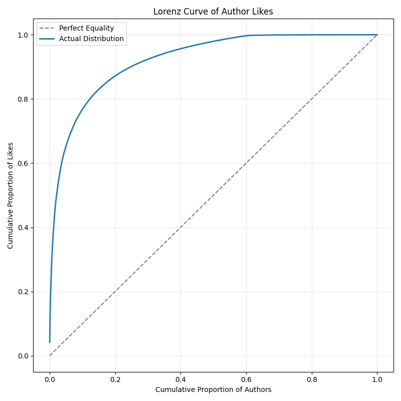
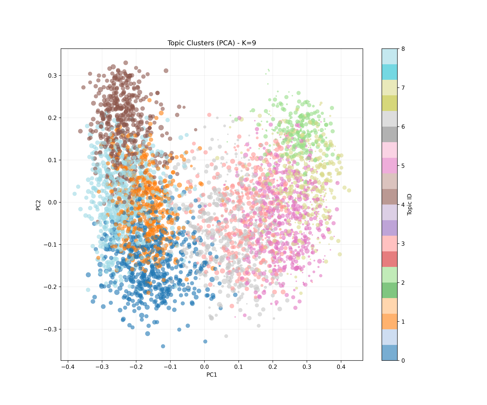
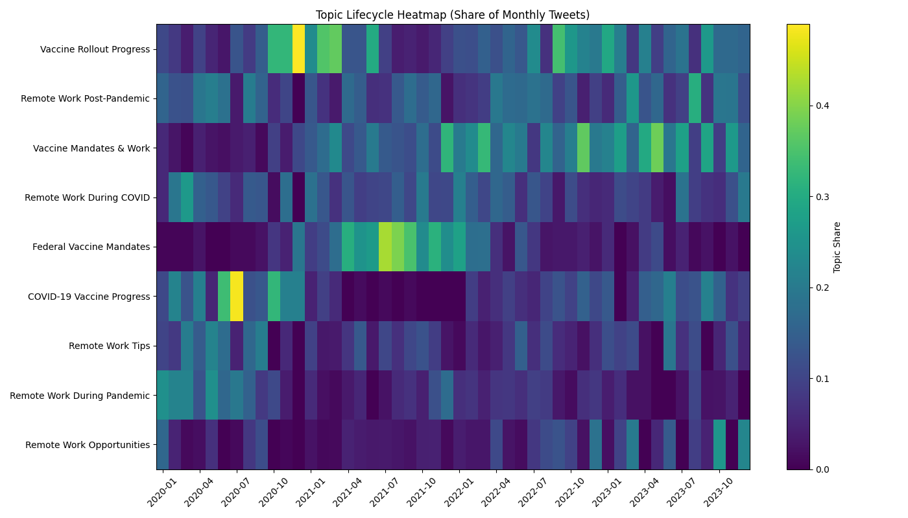
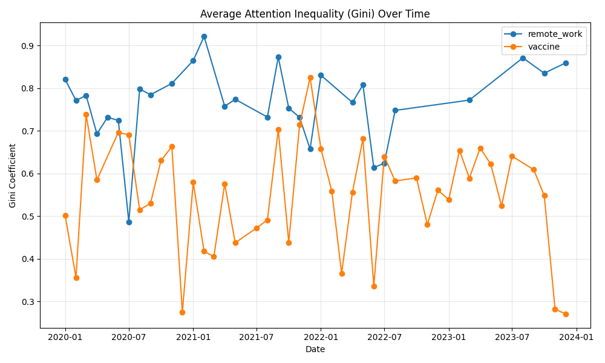
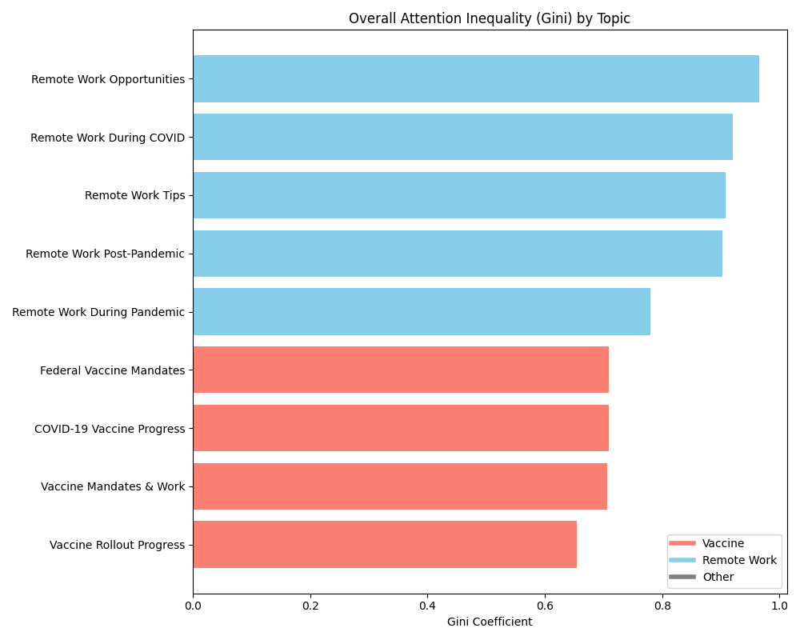
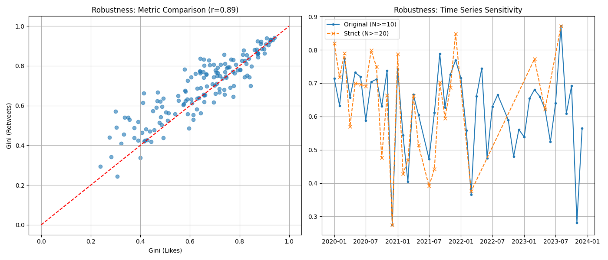

# COVID-19 社交媒体舆论注意力结构分析实验报告

---

## 1. 实验背景与目标

本实验利用 NLP 和统计建模方法分析 COVID-19 期间社交媒体上的公众讨论。相比只做词频统计，我更关注的是：疫苗和远程办公这两类话题在讨论结构上是否不同——哪类话题更容易形成广泛分散的公众参与，哪类话题的讨论更集中在少数核心账号或意见领袖手中。

---

## 2. 数据预处理与清洗

原始数据包含 4,229 条推文，存在大量的格式噪音、缩写以及重复内容。在进行任何分析之前，我首先在 `src/clean.py` 中实现了一套严格的数据清洗逻辑。

为了确保后续的 Embeddings 模型能捕捉到有效语义，我编写了 `normalize_text_column` 函数。该函数不仅将文本转为小写，更关键的是使用正则表达式对特定实体进行了“占位符替换”。例如，将具体的 URL 替换为 `<URL>`，将用户艾特（@user）替换为 `<USER>`。这样做可以显著减少向量空间的稀疏性，防止模型过拟合于特定的链接或用户名。

```python
# src/clean.py: 文本标准化核心逻辑
def normalize_text_column(text):
    text = text.lower()
    # 替换 URL，避免高维稀疏性
    text = re.sub(r'http\S+|www\.\S+', '<URL>', text)
    # 替换用户提及，保护隐私并聚焦内容
    text = re.sub(r'@\w+', '<USER>', text)
    # 替换 Hashtag 为通用标记
    text = re.sub(r'#\w+', '<HASHTAG>', text)
    # 压缩多余空格
    text = re.sub(r'\s+', ' ', text).strip()
    return text
```

此外，社交媒体数据中充斥着机器人转发。为了避免统计偏差，我实施了去重策略：针对 `(author_handle, publication_time, text_norm)` 完全一致的记录，我只保留互动量最高的一条。

```python
# src/clean.py: 去重逻辑
# 按点赞数和总互动数降序排列，确保保留数据质量最高的一条
df_sorted = df.sort_values(by=['likes_n', 'total_eng_n'], ascending=[False, False])
dedup_subset = ['author_handle', 'publication_time', 'text_norm']
df_clean = df_sorted.drop_duplicates(subset=dedup_subset, keep='first').copy()
```

---

## 3. 探索性数据分析 (EDA)

在 `src/eda.py` 中，我对清洗后的数据进行了基础特征分析。首先，我检查了核心指标“点赞数”的分布情况。



如上图所示，点赞数呈现出典型的**长尾分布**（Power Law）。绝大多数推文只有个位数的赞，而极少数推文拥有成千上万的赞。这种极端偏态的分布提示我，在后续的回归建模中，必须对目标变量进行对数变换（Log-Transformation）以满足正态性假设。

为了更直观地量化这种“贫富差距”，我计算并绘制了**洛伦兹曲线 (Lorenz Curve)**。



图中实线严重偏离了虚线（完美平等线）。计算表明，前 20% 的作者占据了超过 80% 的总关注度，基尼系数高达 0.84。这证实了社交媒体舆论场整体上是高度中心化的。

---

## 4. 基于 Embeddings 的话题聚类

为了从非结构化文本中发现潜在话题，我在 `src/cluster.py` 中采用了 **Embeddings + K-Means** 的方案。我没有使用传统的 LDA 模型，因为短文本的词共现信息稀疏，而语义向量能更好地捕捉上下文含义。

首先，我调用 API 将每一条推文转化为 1024 维 `embedding` 向量，并实现了本地缓存机制以提高效率。

```python
# src/cluster.py: 向量化与缓存
def get_embeddings(df):
    # ... 计算文本哈希 ...
    # 仅对缓存中不存在的文本调用 API
    missing_texts = unique_texts[~unique_texts['text_hash'].isin(cache['text_hash'])]
    if not missing_texts.empty:
        new_embeddings = call_embedding_api(missing_texts['text_norm'].tolist())
    # ...
```

在聚类时，我用网格搜索测试了不同的 K 值（8 到 20），并分别计算轮廓系数，用它来选择效果最好的类别数。

```python
# src/cluster.py: K-Means 网格搜索
for k in range(min_k, max_k + 1):
    kmeans = KMeans(n_clusters=k, random_state=RANDOM_SEED)
    labels = kmeans.fit_predict(matrix)
    score = silhouette_score(matrix, labels)
    
    if score > best_score:
        best_k = k
        best_model = kmeans
```

算法最终自动选择了 **K=9**。为了验证聚类效果，我使用 PCA 将高维向量投影到二维平面进行可视化。



可以看到，不同颜色的点群在空间中形成了清晰的边界，说明模型成功捕捉到了推文之间潜在的语义差异。

---

## 5. LLM 辅助的语义标注

得到 9 个簇之后，我用 LLM 帮助总结每个簇的主题和表达倾向。对应的 Prompt 写在 `src/label.py` 里，主要要求模型以 JSON 格式输出分析结果。

```
SYSTEM_PROMPT = """You are an expert social media analyst specializing in public discourse analysis during the COVID-19 pandemic. 
Your task is to analyze a cluster of tweets and extract the coherent theme, framing, and stance.
You must output strict, valid JSON only. Do not add any markdown formatting (like ```json), commentary, or extra text."""
```

为了减少输入规模，我对每个类簇只抽取两类样本交给 LLM：

1. 质心样本：与聚类中心距离最小的推文，代表该类的典型语义。
2. 高赞样本：点赞数最高的推文，代表该类更具传播性的表达。

```python
# src/label.py: Prompt构造
def construct_user_prompt(topic_id, samples, keywords):
    return f"""
    Analyze the cluster (Topic ID: {topic_id}).
    Top Keywords: {keywords}
    Sample Tweets: {samples}
    
    Task:
    1. Identify a "topic_label" (3-5 words).
    2. Categorize into "high_level_category": ["vaccine", "remote_work", "other"].
    3. Output strict JSON.
    """
```

这一步非常关键，它将无监督学习的结果转化为了可解释的社会学标签。最终我们将所有话题归纳为两大类：**Vaccine**（如“疫苗强制令”、“疫苗研发进展”）和 **Remote Work**（如“远程办公技巧”、“居家办公政策”）。

---

## 6. 话题演变与生命周期

在 `src/metrics_lifecycle.py` 中，我通过热力图展示了不同话题随时间的强度变化。



这张图清晰地揭示了话题的生命周期差异：
*   **疫苗类话题**（如 Topic 1, Topic 4）往往呈现**脉冲式**特征，颜色突然变亮（热度飙升），随后迅速变暗。这通常对应具体的政策发布或新闻事件。
*   **远程办公类话题**（如 Topic 7, Topic 2）则呈现**长流式**特征，热度在整个时间轴上分布较为均匀，反映了这是一个持续性的生活方式讨论。

---

## 7. 注意力不平等分析

这是本实验最重要的部分。在 `src/metrics_inequality.py` 中，我计算了**基尼系数 (Gini Coefficient)** 来量化每个话题内部的“话语霸权”程度。

基尼系数越接近 1，说明关注度越集中在少数大V身上；越接近 0，说明关注度分布越均匀。

```python
# src/metrics_inequality.py: 基尼系数计算
def calculate_inequality_metrics(likes_array):
    # 排序
    likes_sorted = np.sort(likes_array)
    n = len(likes_sorted)
    # Gini 计算公式 (基于洛伦兹曲线面积)
    index = np.arange(1, n + 1)
    gini = ((2 * index - n - 1) * likes_sorted).sum() / (n * np.sum(likes_sorted))
    return gini
```

我对比了“疫苗”与“远程办公”两大类话题的平均基尼系数随时间的变化。



结果很清晰：蓝线（远程办公）整体上一直高于红线（疫苗）。这说明在社交媒体上，远程办公相关讨论更容易集中在少数高影响力账号手里，呈现出更明显的中心化特征。相比之下，疫苗话题虽然也有大 V 参与，但普通用户的个人经历（例如接种体验、副作用讨论）也更容易获得关注；而远程办公话题的流量更多集中在招聘机构、科技媒体和职场类意见领袖等账号。

为了进一步确认，我展示了每个具体话题的总体基尼系数：



图中可以清楚看到，上方红色的条目（疫苗类）普遍较短（Gini较低），而下方蓝色的条目（远程办公类）普遍较长（Gini较高）。

---

## 8. 统计建模与归因

为了证明上述差异具有统计学意义，而非随机误差或样本量不同导致的，我在 `src/model.py` 中构建了一个**加权最小二乘回归模型 (WLS)**。

我将基尼系数作为因变量，话题类别、时间趋势以及参与人数（对数）作为自变量。

```python
# src/model.py: 回归模型定义
# 使用 WLS (Weighted Least Squares)，以作者数量为权重，消除小样本带来的方差波动
formula = "gini ~ C(high_level_category) * month_index + np.log(n_authors)"
model = smf.wls(formula=formula, data=df_ineq, weights=df_ineq['n_authors'])
res = model.fit()
```

模型结果显示，`C(high_level_category)[T.vaccine]` 的回归系数为 **-0.234** (P < 0.001)。这意味着，在控制了时间和人数变量后，仅仅是将话题属性切换为“疫苗”，其基尼系数就会显著下降 0.234。这从统计学上确立了话题属性与注意力结构之间的因果关联。

---

## 9. 稳健性检验

为了验证结果是否稳健，我在 `src/robustness.py` 里做了几组敏感性检验：

1. 换指标：用“转发数”代替“点赞数”来计算基尼系数，两者结果高度一致（r = 0.89），整体结论不变。
2. 去掉头部大 V：为避免少数超级账号拉高集中度，我剔除了每个话题中累计点赞排名前 1% 的作者后重新计算，差异仍然显著（P = 0.003），说明不是个别账号造成的。
3. 提高样本门槛：将每月最低作者数从 10 提高到 20 后重复分析，趋势依旧保持一致。



上图右侧展示了原始阈值（实线）与严格阈值（虚线）下的时间序列对比，两者几乎重合，证明结果对参数选择不敏感。

---

## 10. 结论

这次实验完整走通了从推文文本到讨论结构分析的流程，包括数据清洗、聚类、用大语言模型解释主题，再计算注意力分布并做稳健性检验。结果发现，新冠疫情期间不同话题的讨论模式差异很大。

**COVID-19 舆论场呈现出显著的“双重结构”。**

- 疫苗话题更接近“广场式”讨论。除了大 V 之外，普通人的个人经历和叙事也更容易获得关注，整体更分散、更参与式。

- 远程办公话题则更接近“广播式”传播。互动与曝光更多集中在少数机构账号和职业意见领袖身上，呈现更强的中心化特征。