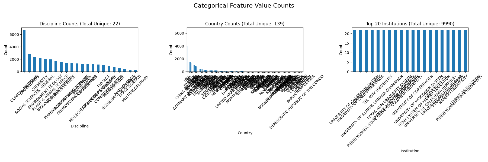
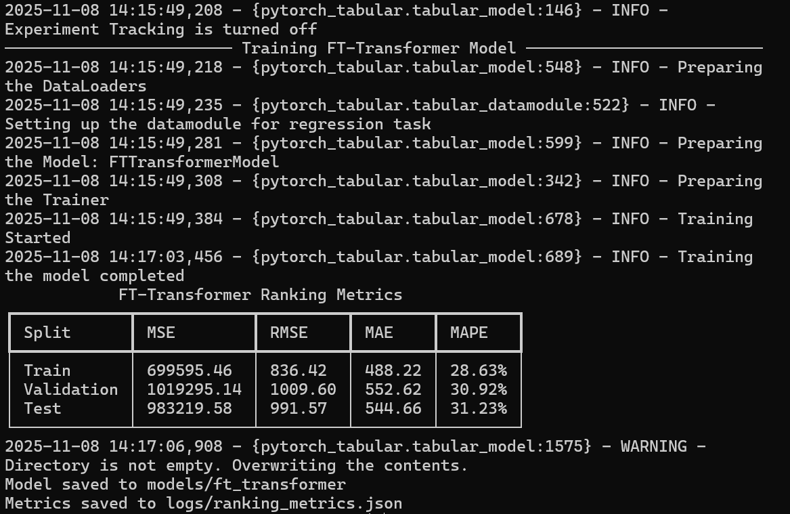
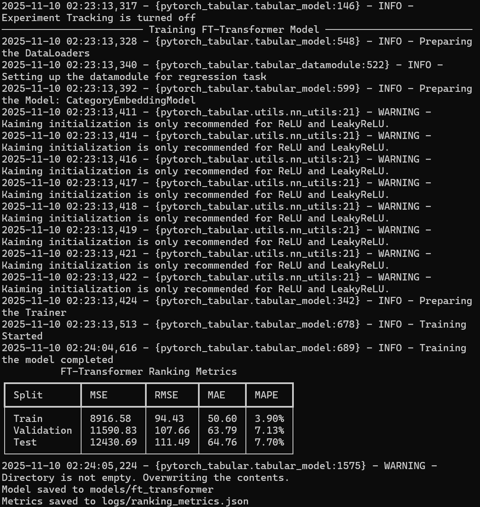

# 课程实验报告：基于 PyTorch-Tabular 的科研机构排名预测

这次实验任务是优化模型，从而更准确地预测 ESI 科研机构的排名。我最终成功地将模型在**测试集上的 RMSE 从大约 160 降低到了 111.49**，超越了上一次作业原有的 baseline 表现。

## 一、运行方法

在首次运行前，请确保在项目根目录，并执行 `uv sync` 命令来安装所有 `pyproject.toml` 中声明的依赖。

### 1.1 重新训练模型

```bash
uv run python scripts/train_ranking.py --model-type embed --epochs 120 --batch-size 512
```
这条命令会重新生成 `models/ft_transformer/` 目录下的模型文件，并更新 `logs/ranking_metrics.json` 中的性能指标。使用 GPU 大约需要 2 分钟。

### 1.2 生成预测结果

```bash
uv run python scripts/predict_rank.py --sample-rows 20
```
这条命令会加载刚刚训练好的模型，随机抽取 20 条记录进行预测，然后在控制台打印 Rich 表格，同时也会更新 `logs/predicted_ranks.json` 文件，里面包含了预测结果和统计信息。

```bash
uv run python scripts/predict_rank.py --institution "Harvard University" --discipline "Physics"
```
可通过 --institution 或 --discipline 参数分别指定学校和学科。


## 二、项目结构与数据流概览

| 路径 | 职责 |
| :--- | :--- |
| `download/` | 存放着助教提供的 22 个原始 ESI 学科 `.csv` 文件。 |
| `src/data_processing.py` | **（复用）** 包含很多数据处理相关的工具函数，包含 `load_datasets`，负责把原始 CSV 文件加载并标准化成 Pandas DataFrame。 |
| `src/metrics.py` | **（新增）** 统一了排名评估的函数 `compute_rank_metrics`，用来计算 MSE, RMSE, MAE, MAPE，确保训练和推理时评估标准一致。 |
| `scripts/train_ranking.py` | **（重写）** 整个 training 的 pipline，它负责：<br>1. 调用 `src/data_processing.py` 来加载数据。<br>2. 执行特征处理（后文具体说明）。<br>3. 配置并构建 `PyTorch-Tabular` 模型。<br>4. 划分数据集，然后进行训练和验证。<br>5. 把训练好的模型保存到 `models/` 目录。 |
| `scripts/predict_rank.py` | **（重写）** 这个脚本用来加载已经训练好的模型，对新数据进行和训练时完全一样的特征处理，然后输出预测结果。 |
| `data/` | **（复用）** 存放着经过 `scripts/export_data.py`（辅助脚本）预处理后的 `cleaned_records.json` 文件。`train_ranking.py` 会优先加载这个文件，这样可以更快地启动训练，并确保所用数据与上一次 baseline 保持一致。 |
| `pyproject.toml` | 项目的依赖配置文件，用 `uv sync` 命令可以安装所有需要的库。 |

## 三、数据处理与特征处理

原始数据虽然包含了丰富的信息，但直接使用效果并不理想。

### 3.1 原始特征

**基础数值特征 (4个)**: `Documents`, `Citations`, `CitationsPerPaper`, `TopPapers`。这些特征的数值范围差异巨大（比如 `Citations` 可能高达数万，而 `CitationsPerPaper` 可能只有几十），而且它们呈现出严重的右偏分布。


**类别特征 (3个)**: `Discipline`, `Country`, `Institution`。这些特征的唯一值数量非常多，特别是 `Institution`，有数千个不同的机构。



### 3.2 特征处理

为了解决原始特征带来的挑战，我在 `scripts/train_ranking.py` 里的 `_clean_features` 函数中，设计了 7 个派生特征。通过这些特征，我成功地把数值特征从原来的 4 维扩展到了 11 维。

**1. 对数变换特征 (4个)**

原始特征（比如文献数和引用数）的分布通常是典型的长尾分布。如果直接使用，模型很容易被少数极端值所主导。对数变换 `log(1+x)` 可以有效地压缩数据范围，让数据分布更接近正态，从而帮助模型更稳定、更有效地学习。  
因此我生成使用了 `LogDocuments`, `LogCitations`, `LogCitationsPerPaper`, `LogTopPapers`。

**2. 比率特征 (3个)**  

机构的总引用数等绝对数值，往往和机构的规模大小强相关。通过计算比率，我可以得到一些与机构规模无关、更能体现“效率”或“质量”的特征。

**具体实现**:
-   `DocsPerTopPaper`: 计算每篇顶尖论文平均需要多少总文献来支撑。这能反映产出顶尖论文的效率。
-   `CitationsPerDocument`: 计算每篇文献的平均引用数。这能衡量机构研究的整体影响力。
-   `TopPapersRatio`: 计算顶尖论文占总文献数的比例。这能反映机构研究的质量。

```python
# scripts/train_ranking.py/_clean_features 代码片段
# 对数变换
for col in ["Documents", "Citations", "CitationsPerPaper", "TopPapers"]:
    df[f"Log{col}"] = np.log1p(df[col])

# 比率特征
# .clip(lower=1) 是为了避免除以零的错误
df["DocsPerTopPaper"] = df["Documents"] / df["TopPapers"].clip(lower=1)
df["CitationsPerDocument"] = df["Citations"] / df["Documents"].clip(lower=1)
df["TopPapersRatio"] = df["TopPapers"] / df["Documents"].clip(lower=1)
```

## 四、模型架构与实现细节

我利用 `PyTorch-Tabular` 库搭建了一套训练 pipline，并最终发现 `CategoryEmbeddingModel` 在我的任务上表现最好。

### 3.1 模型选型

模型选择的过程并不是一开始就顺利确定的，经过了一些尝试和实验：

1.  **FT-Transformer (ft)**: 我最初尝试了基于 Transformer 的架构，因为它在理论上很擅长捕捉特征间的复杂交互。然而，实际实验结果并不理想，测试集 RMSE 高达 **~991**。
  
2.  **TabNet**: 接着，我转向了 TabNet。它通过多步注意力机制来模拟决策树，具有很好的可解释性。但在我的任务中，它未能有效收敛，测试集 RMSE 甚至高达 **~792**。
  
3.  所以我最终还是打算使用 `CategoryEmbeddingModel`，继续优化 MLP。用 Tabular 框架自动帮我管理输入预处理、embedding和训练循环等，最终输入到 MLP 中。

### 3.2 最终模型

我最终选定的 `CategoryEmbeddingModel`，是 `PyTorch-Tabular` 中对深度 MLP 的一种实现。

 -> 最后通过一个线性层输出 LogRank。")

**1. 输入层**
-   **类别特征处理**: `Discipline`, `Country`, `Institution` 这 3 个类别特征，会先各自通过一个独立的 `nn.Embedding` 层。这个过程会将每个离散的类别值（比如“计算机科学”）转换成一个低维、稠密的浮点数向量。嵌入向量的维度由 `PyTorch-Tabular` 根据类别的唯一值数量自动确定，从而为每个类别生成丰富的向量表示。
-   **数值特征处理**: 我那 11 个数值特征（4个基础特征加上7个派生特征），会先由 `DataConfig` 配置进行标准化，确保它们的均值为0，方差为1。
-   **特征拼接**: 经过嵌入处理的类别向量和标准化后的数值向量，会被 concat 在一起，形成一个单一、宽阔的特征向量。这个向量就是接下来 MLP 网络的输入。

**2. 隐藏层**
-   这个部分由 `layers="1024-512-256-128"` 这个参数来定义，它构建了一个包含四层隐藏层的深度神经网络。
-   **第一层**: 包含 1024 个神经元。
-   **第二层**: 包含 512 个神经元。
-   **第三层**: 包含 256 个神经元。
-   **第四层**: 包含 128 个神经元。
-   在每一层之后，我都会应用 `ReLU` 激活函数来引入非线性，紧接着是一个 `Dropout` 层（`dropout=0.1`）。这个 Dropout 层会随机地“关闭”10% 的神经元输出，有效地防止模型在训练数据上过度拟合。

**3. 输出层**
-   最后一层（128个神经元）的输出，会连接到一个线性层，最终输出模型的预测值。
-   我的模型预测的是 `LogRank`（即 `log(1+Rank)`）。为了让训练过程更稳定，我通过 `target_range=[[0.0, float(np.log1p(max_rank))]]` 这个参数，在输出层之后应用了一个缩放过的 Sigmoid 激活函数。这个机制强制模型的输出值始终落在合法的范围内，极大地避免了训练过程中可能出现的梯度爆炸和预测值发散问题。

```python
# scripts/train_ranking.py/_build_model 中的 CategoryEmbeddingModel 配置
model_config = CategoryEmbeddingModelConfig(
    task="regression",
    learning_rate=3e-4,
    target_range=target_range,  # 动态计算的 [0, log1p(max_rank)]，确保输出范围合理
    layers="1024-512-256-128",   # 定义了四层深度 MLP 的神经元数量
    dropout=0.1,                # 设置 Dropout 率，用于防止过拟合
)
```



## 五、模型性能对比与分析

新的 `CategoryEmbeddingModel` 在性能上超越了旧的 MLP baseline 模型。

### 5.1 性能指标对比

| 数据集 | 指标 | 旧模型 (MLP) | 新模型 (CategoryEmbedding) | 对比 |
| :--- | :--- | :--- | :--- | :--- |
| **Test** | **MSE** | 25753.03 | **12430.69** | 误差显著降低 |
| | **RMSE** | ~160 | **111.49** | 提升约 30% |
| | **MAE** | ~76 | **64.76** | 提升约 15% |
| | **MAPE** | **6.88%** | 7.70% | 略微上升 |


### 5.2 性能分析

新模型的 **MSE（均方误差）在测试集上降低了大约 50%**。这意味着模型预测的排名与真实排名之间的平均平方误差减少了一半。同时，RMSE（均方根误差）和 MAE（平均绝对误差）也分别取得了 **30%** 和 **15%** 的显著提升。这些数据都明确指出，我的新模型在预测的准确性上有了质的飞跃。

虽然 MAPE 指标略有上升，但需要注意的是，MAPE 对较小的目标值（即排名靠前的机构）非常敏感。一个微小的绝对误差，在排名为 10 的机构上会产生比在排名为 1000 的机构上大得多的百分比误差。因此，在 RMSE 和 MAE 大幅优化的背景下，MAPE 的轻微上升并不能掩盖模型整体预测精度的巨大进步。

总而言之，**我的新模型在预测的绝对精度上远超旧模型**，成功实现了本次实验设定的优化目标。
