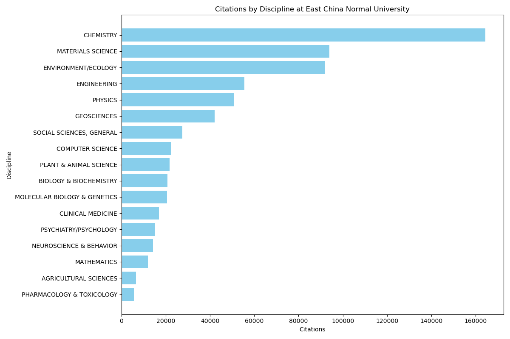
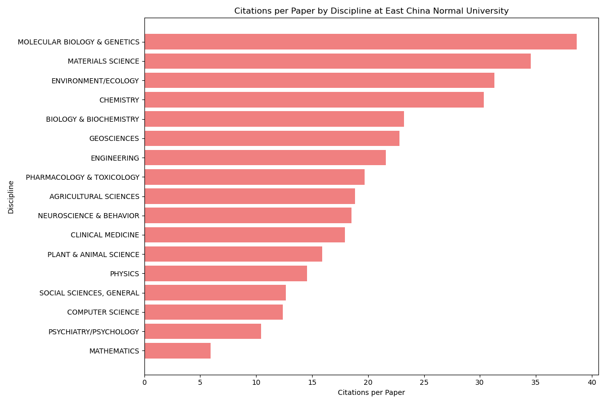
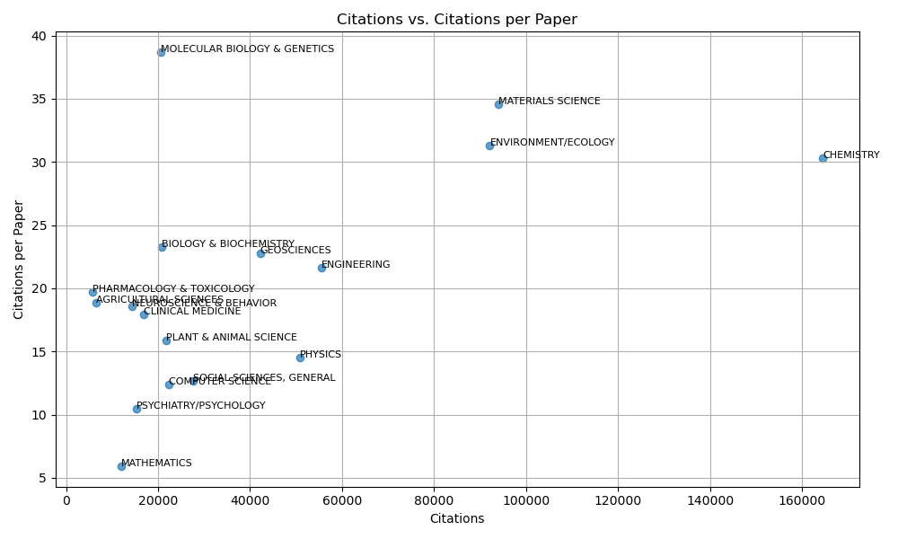

# 华东师范大学 ESI 学科表现分析作业

这次作业我主要做了两件事：
一是写了个脚本，把 ESI 官网的数据批量抓了下来；
二是用 Python 对华东师范大学（East China Normal University）的 ESI 学科表现做了一次分析，看看学校在哪些方向比较强，，以及在哪些方面还有提升空间。

---

## 一、数据爬取

我写了一个小爬虫脚本 `scrape-esi.js`，用的是 Puppeteer + Edge 浏览器。

第一次运行的时候需要加 `--login` 参数，手动登录一次学校的 Clarivate 账号。之后登录状态会保存到 `edge-profile/` 文件夹里，下次再跑就不用重新登录了。

爬虫的原理是直接抓网页的后台接口数据。ESI 的表格其实是通过一个叫 `IndicatorsDataAction.action` 的接口加载的，我在 Puppeteer 里监听网络请求，找到这个接口后就可以自己构造请求。
每次请求获取100条记录（这是ESI的分页限制）。拉取一页数据后，等待700毫秒再继续获取下一页，当返回数据少于100条时停止。程序还实现了重试机制，若网络缓慢或响应返回HTML内容，则重新加载页面并重复流程，最多重试5次。

最后我把每个学科的数据都保存成了单独的 CSV，比如：

```
esi_institutions_by_Chemistry.csv
esi_institutions_by_Computer_Science.csv
esi_institutions_by_Physics.csv
...
```

另外还单独拉了一份学校自己的数据表 `esi_fields_of_East_China_Normal_University.csv`，里面是华东师范大学在各个 ESI 学科的表现，包括总被引次数、论文篇数、篇均被引次数等。

总的来说，这个爬虫做到了：

* 自动登录 + 会话复用；
* 分页爬取 + 限速重试；
* 自动保存为 CSV 文件；

---

## 二、分析的思路和做法

爬完数据后，我写了一个 Python 脚本 `analysis.py` 来整理和可视化结果。用的是 `pandas` 做数据清洗，`matplotlib` 画图。

首先我把 `ALL FIELDS` 这一行删掉（那是所有学科的汇总，没参考价值），然后把字段改成更好懂的名字，比如：

* `name` → `Discipline`
* `cites` → `Citations`
* `cites_per_paper` → `Citations_per_Paper`

之后我主要看了三个方面：

1. **各学科的总被引次数（整体影响力）**
   
   这张图一看就能发现，化学、材料科学、环境/生态学这几个学科的引用数明显高。

2. **篇均被引次数（单篇论文质量）**
   
   在这张图里，分子生物与遗传学、材料科学、环境/生态学都在前列，尤其是分子生物学的篇均引用非常高，说明虽然论文数量不多，但质量很强。

3. **散点图（看学科的“量”和“质”）**
   
   这张图表同时揭示了哪些学科既“高产”（高引用次数）又“高影响力”（高篇均引用）。化学、材料科学和环境生态学都位于右上角，是典型的既高产又强势的领域。
   工程学和物理学虽然总量大，但篇均引用偏低。数学、心理学那边则双低，说明无论是产出还是影响力都比较弱。

---

## 三、结合全球排名看

我还查了 ESI 的全球机构排名数据，用同样的爬虫拉下来的。
在化学（Chemistry）里，华东师范大学排到**全球第 90 名**；
在计算机科学（Computer Science）领域大概是**第 207 名**。

这两个数字能说明问题：化学在 ESI 上排名较高，而计算机科学虽然也榜上有名，但仍处于第二梯队，主要差距在于研究论文的影响力。

---

## 四、小结

从我爬取到的数据来看：

1. **化学、材料、环境生态**能发论文、也能被引用，可能科研团队比较成熟。
2. **分子生物与遗传学**虽然规模小，但质量很高，属于“小而精”的类型。
3. **工程学和物理学**属于“大而不精”，可能论文产量高但影响力一般，可以往更高质量方向优化。

华东师范大学在 ESI 数据里表现还不错，尤其是在化学、材料科学、环境生态这几个方向上，已经有全球前 100 的排名；
但像计算机科学、物理学这种产出型学科还需要提升单篇论文的影响力。
另外，数学和心理学的引用表现比较弱，可能和学科属性有关，可能可以鼓励交叉研究，比如心理与教育结合、数学与材料建模结合等。
