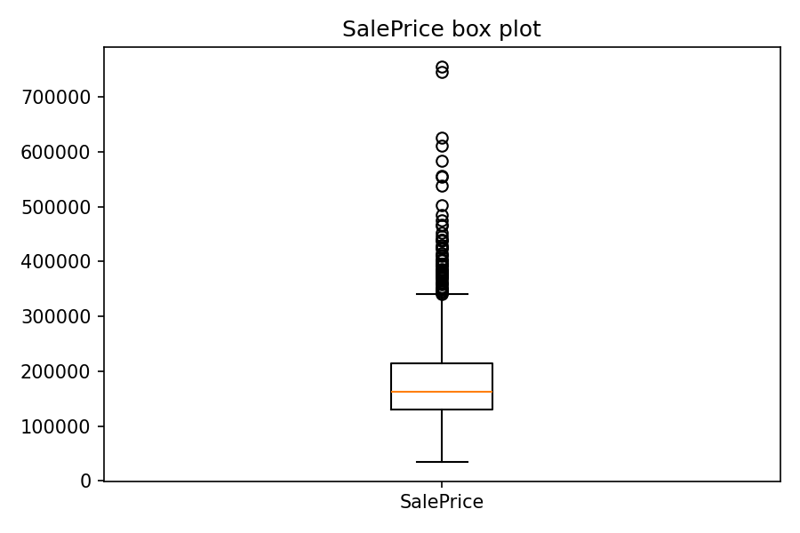

# 实验二：数据预处理的基本方法（房价数据集）

## 1. 数据与环境

- 数据来源：课程提供的房价训练集 `data/train.csv`，包含 1460 行、81 列，其中目标变量为 `SalePrice`。
- 运行环境：Jupyter Notebook；主要文件与输出如下：
  - `lab2.ipynb`：完整过程的实现；
  - `figures/`：分析图表（直方图、箱线图、相关热力） `price_hist.png`, `price_boxplot.png`, `price_corr_heatmap.png`；
  - `data/train_processed.csv`：预处理后的数据集。
## 2. 实验内容与实现

### 2.1 缺失值的检测与处理

关于数据缺失情况，我先使用 df.isna().sum() 逐列统计缺失值数量并计算缺失率，按降序排序以定位缺失最严重的列；之后会在表格中总览结果，再结合具体语义决定处理策略。

我的处理策略是根据表格类型分别处理：
对于数值型数据采用中位数填充；
对于分类型数据，一般使用众数填充，但对“缺失即表示不存在”的字段，则使用占位值标记，避免伪造数据。
例如 Alley、Fence、PoolQC、FireplaceQu、GarageType、GarageFinish、GarageQual、GarageCond、Bsmt* 相关字段以及 MiscFeature 用 "NA" 标记；MasVnrType 用 "None" 表示无贴面；GarageYrBlt 在无车库时用 0 填充。

典型的填充预览如下：

| column         | strategy     | fill_value |
| -------------- | ------------ | ---------- |
| Alley          | special_fill | NA         |
| MasVnrType     | special_fill | None       |
| BsmtQual…      | special_fill | NA         |
| FireplaceQu    | special_fill | NA         |
| GarageType…    | special_fill | NA         |
| PoolQC / Fence | special_fill | NA         |
| MiscFeature    | special_fill | NA         |
| GarageYrBlt    | special_fill | 0          |
| LotFrontage    | median       | 69.0       |
| MasVnrArea     | median       | 0.0        |
| Electrical     | mode         | SBrkr      |

根据我的理解，表格中某些字段的缺失通常表示“该设施不存在”。如果使用众数或中位数进行填充，可能会将“无车库/无地下室/无泳池”错误地替换为“有车库/有地下室/有泳池”，从而产生虚假信息。因此，我认为保留 `NA` 值最能准确传达原意。

### 2.2 异常值检测

**IQR 离群点检测**

IQR = Q3 - Q1，判定区间为 `[Q1 - 1.5*IQR, Q3 + 1.5*IQR]`。

我对所有数值列进行了检测，发现像 `EnclosedPorch`、`BsmtFinSF2` 等工程面积类的“尾部样本”较多；`SalePrice` 按 IQR 也会标记出 61 个高价点。

因此我在处理数据时不直接删除异常值，而是改用温莎化方法。
具体来说，对数值型特征统一做1%到99%分位温莎化：低于1%分位数的值提升到1%分位数，高于99%分位数的值下调到99%分位数。
我在输出里记录了每一列的（p1, p99, n_clipped_low, n_clipped_high），比如地上居住面积（GrLivArea）就有30个样本被调整到边界。另外目标变量SalePrice只做分析，不进行温莎化也不删除。

### 2.3 特征间的相关性分析

这里完成了对非数值列的预处理，并计算了Pearson和Spearman相关系数，取前十排序后绘制了相关矩阵热力图。
结果与预期较为一致：

- OverallQual（约0.79）相关性最高，表明房屋整体质量对价格有显著正向影响；
- 其次是GrLivArea（约0.71），说明可居住面积与价格呈正相关；
- GarageCars和GarageArea（约0.65/0.63）也显示明显正相关，印证了车库规模对价格的积极作用；
- 此外，TotalBsmtSF、1stFlrSF等面积变量均与价格呈显著正相关。

**结论（与 price 相关性最高的三个特征并解释）**
1. **OverallQual**：房屋整体质量评分，直接体现材料与做工的档次，是价格最核心的溢价来源；
2. **GrLivArea**：地上居住面积，决定了功能与舒适度，价格对面积高度敏感；
3. **GarageCars**（或 **TotalBsmtSF**）：车位数/地下室面积代表实用空间与储物能力，在独栋住宅市场里可见度高、议价明显。

### 2.4 `SalePrice` 标准化

关于房价数据的标准化处理，我采用了 Z-Score 方法，具体操作为 `price_z = (SalePrice - mean) / std`。
这一处理仅新增 `price_z` 列，不会改变原始 `SalePrice` 数据，便于后续建模或可视化分析。
处理后的 `price_z` 列均值接近 0、标准差约为 1。

### 2.5 `SalePrice` 离散化

我采用等频分箱方法（qcut，q=4）将数据划分为四档：Low、MidLow、MidHigh、High，确保各档样本量基本均衡。同时会记录四分位阈值（Q1、Median、Q3）以便复现。

## 3. 学习过程记录

- 用 `read_csv / shape / head` 快速熟悉数据，理解 `NaN` 在 pandas 中的表达；
- `Series` 与 `DataFrame` 的区别，以及“利用索引自动对齐”把多个 `Series` 合并成表格。`missing_counts` / `missing_pct` 是Series；把它们放进字典再构造 DataFrame，pandas 会按索引（列名）自动对齐生成 2D 表格。；
- “缺失≠随机丢值”，有些是“业务上的不存在”，需要用 `"NA/None/0"` 表示；
- 掌握了 IQR 的判定逻辑，四分位距（IQR = Q3 − Q1），常用阈值 `[Q1 − 1.5×IQR, Q3 + 1.5×IQR]` 标记异常；
- 温莎化：把低于下阈值/高于上阈值的极端值，截到阈值上，而不是删除样本。常用 1%–99% 或 0.5%–99.5%。

