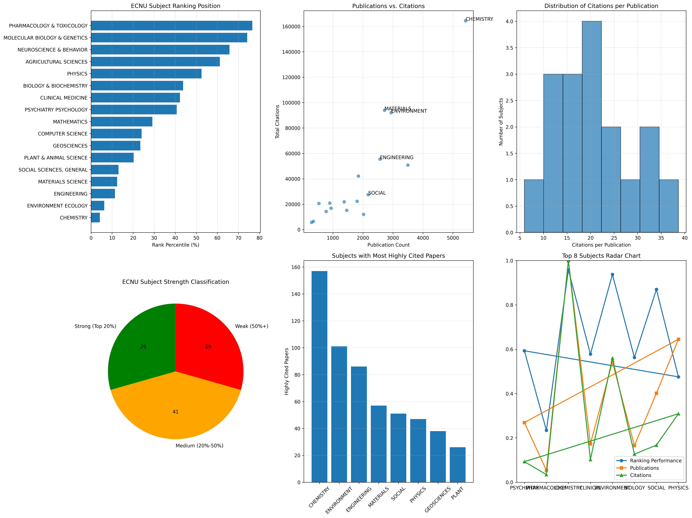
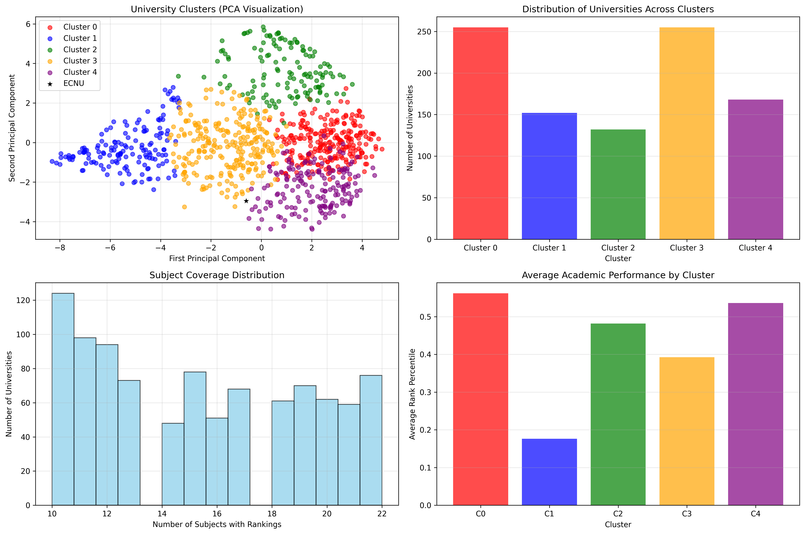
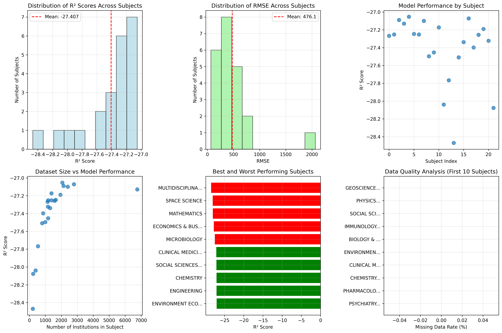

## 项目运行与环境

我使用 `uv` 作为包管理工具，通过 `uv add pandas numpy scikit-learn matplotlib seaborn` 命令安装了所有必需的依赖库。所有分析脚本均通过 `uv run python [script_name].py` 直接运行。

## q9: 华东师范大学学科画像

为了做一个学科画像，我需要处理所有分学科的排名数据，提取出 ECNU 的各项指标，并以可视化的方式呈现其学科优势、劣势及综合实力。

我编写了 `q9_ecnu_analysis.py` 脚本来自动化数据提取过程。该脚本遍历 `download/` 目录下的全部 CSV 文件，在每个文件中查找 “East China Normal University”，并记录其排名、各项评分指标。

```python
# q9_ecnu_analysis.py

def analyze_ecnu_performance():
    # ... (setup code)
    for file in csv_files:
        df = pd.read_csv(os.path.join(data_dir, file))
        ecnu_data = df[df['University'] == 'East China Normal University']
        if not ecnu_data.empty:
            rank = ecnu_data.iloc[0]['Rank']
            total_universities = len(df)
            percentile = (rank / total_universities) * 100
            # ... (data extraction)
            results.append({
                'Subject': subject_name,
                'Rank': rank,
                'Percentile': percentile,
                # ... (other metrics)
            })
    # ... (saving results)
```

这部分代码的关键是定位华师大并计算其排名百分位，这比绝对排名更能体现其相对位置。

接着，我创建了 `q9_visualization.py` 脚本，利用 Matplotlib 和 Seaborn 库，将提取的数据生成了六张图表，包括排名百分位条形图、发文量与引用数的散点图、以及综合表现的雷达图，最终合成为一张总览图 `ecnu_analysis.png`。

我通过 `uv run python q9_ecnu_analysis.py` 和 `uv run python q9_visualization.py` 运行了脚本，成功生成了数据和图表。分析显示，ECNU 在化学、环境生态学等学科表现强势，但在分子生物学与遗传学等领域相对薄弱。



## q8：全球高校可以大致分为哪几类

我想知道在全球范围内，哪些大学与华东师范大学的学科发展模式相似。为此，我需要对所有高校进行分类，并将 ECNU 定位到某一类别中，然后找出该类别内与它最相似的几所学校。

我首先在 `q8_university_clustering.py` 中构建了一个 “大学-学科” 排名矩阵。我筛选了至少在 10 个学科中有排名数据的 962 所大学，并用它们在 22 个学科的排名数据填充矩阵（缺失值以一个较大的惩罚性排名代替）。

然后，我使用 `StandardScaler` 对数据进行标准化，以消除不同学科排名范围差异带来的影响。接着，我应用 K-Means 聚类算法（设置 k=5）对大学进行分类。

```python
# q8_university_clustering.py

def perform_clustering():
    # ... (matrix construction)
    scaler = StandardScaler()
    scaled_matrix = scaler.fit_transform(rank_matrix)

    kmeans = KMeans(n_clusters=5, random_state=42, n_init=10)
    clusters = kmeans.fit_predict(scaled_matrix)
    
    # ... (PCA and visualization)
    pca = PCA(n_components=2)
    reduced_data = pca.fit_transform(scaled_matrix)
    
    # ... (plotting code)
```

为了找到与 ECNU 最相似的大学，我在 `q8_cluster_analysis.py` 中计算了 ECNU 与其所在聚类（Cluster 3：均衡型综合性大学）中所有其他大学的欧氏距离。

运行 `q8_university_clustering.py` 后，我得到了五个高校类别，并通过 PCA 降维将其可视化为 `university_clusters.png`。结果显示 ECNU 属于“均衡型综合性大学”，同类别的还有布朗大学、范德堡大学等。与 ECNU 最相似的大学是重庆大学、滑铁卢大学和北京师范大学。



## q10：学科排名预测

我尝试构建一个机器学习模型，利用大学在各个学科的指标数据（如发文量、引用数）来预测其排名。目标是检验这些指标对排名的预测能力，并找出关键影响因素。

我编写了 `q10_ranking_prediction.py` 脚本。对于每个学科，我将排名前 60% 的大学数据作为训练集，后 20% 作为测试集，中间跳过 20% 以避免数据泄露。我同时尝试了线性和随机森林两种回归模型。

```python
# q10_ranking_prediction.py

def build_prediction_model(subject_data):
    features = ['Publications', 'Total Citations', 'Citations per Publication', 'Highly Cited Papers']
    target = 'Rank'
    
    X = subject_data[features]
    y = subject_data[target]

    # Splitting data 60-20-20
    train_size = int(0.6 * len(X))
    test_size = int(0.2 * len(X))
    X_train, y_train = X[:train_size], y[:train_size]
    X_test, y_test = X[-test_size:], y[-test_size:]

    # ... (model training and evaluation)
    rf_model = RandomForestRegressor(n_estimators=100, random_state=42)
    rf_model.fit(X_train, y_train)
    
    # ... (return evaluation metrics)
```

在 `q10_model_analysis.py` 中，我分析了模型的性能，特别是随机森林模型的特征重要性。

我通过 `uv run python q10_ranking_prediction.py` 为所有 22 个学科训练了模型。结果并不理想，R² 分数普遍为负数，表明模型预测效果比直接取平均值还差。可能确实不太适合把排名作为连续变量进行回归预测。

特征重要性分析显示，“总引用数”这一特征占据了 99.97% 的权重，说明特征间存在严重的多重共线性。


