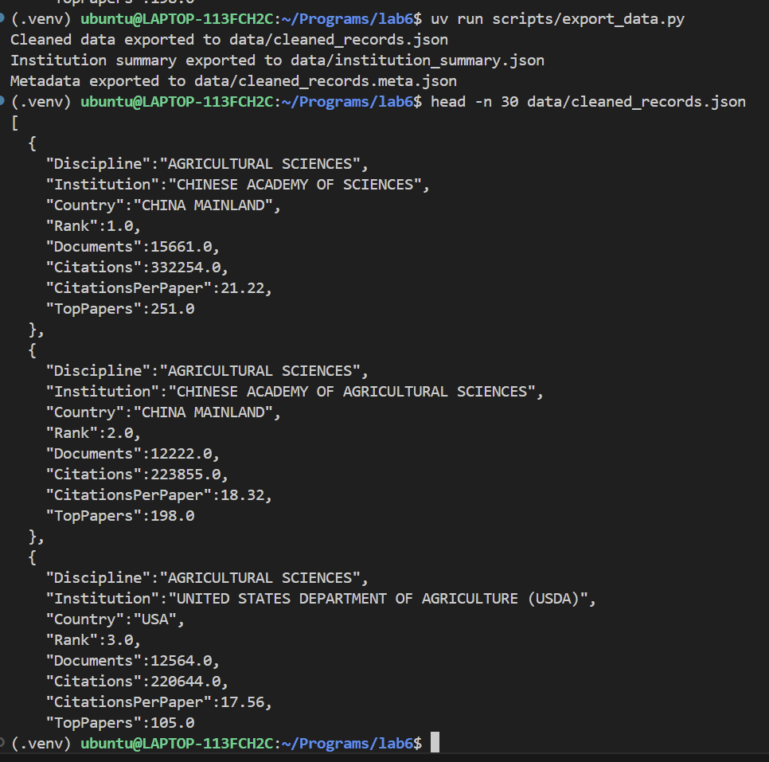
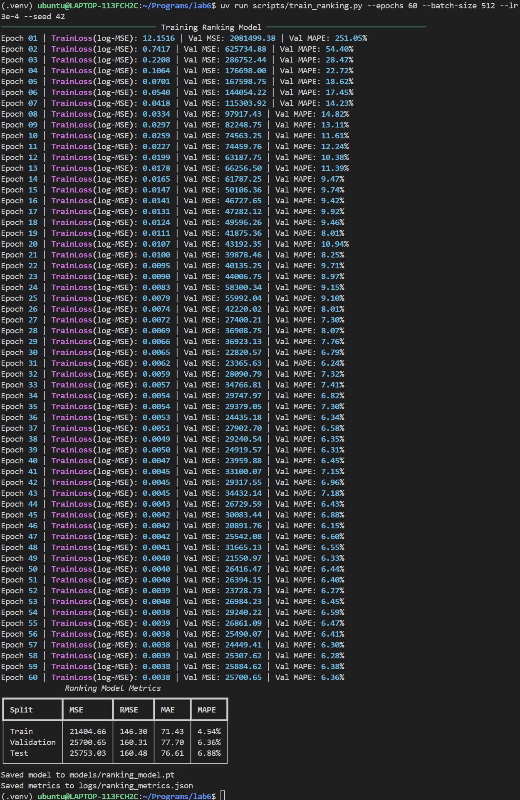
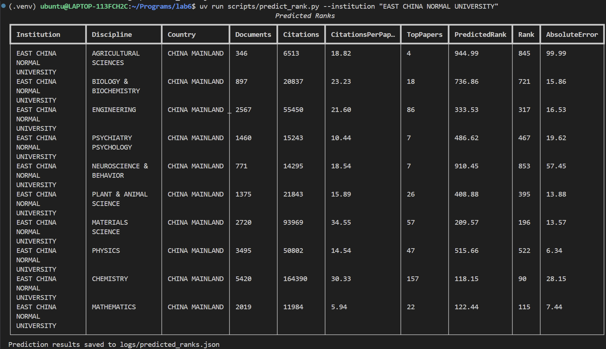
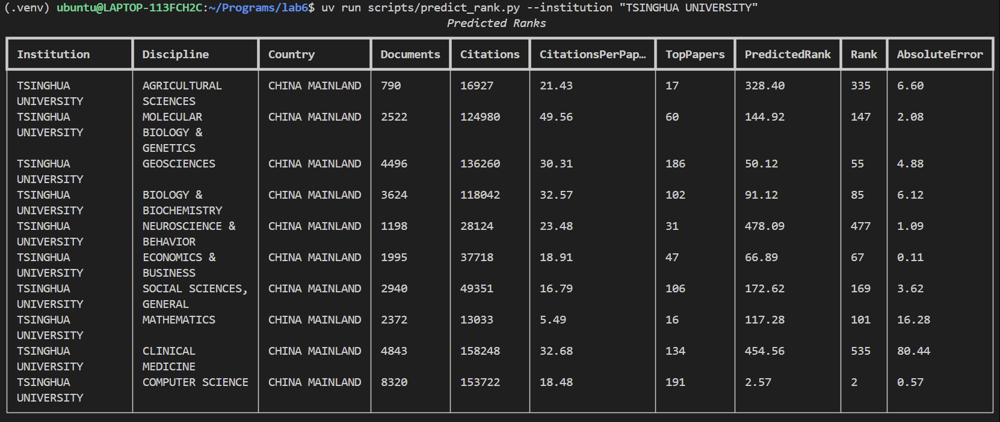
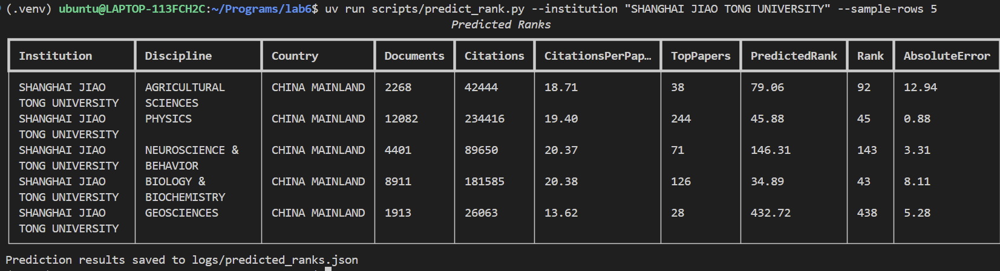
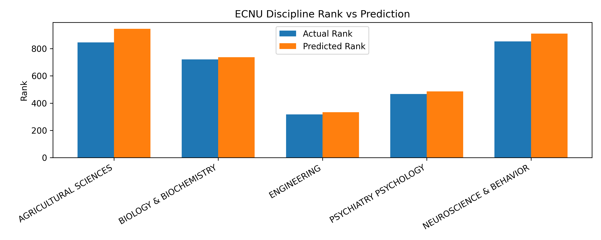
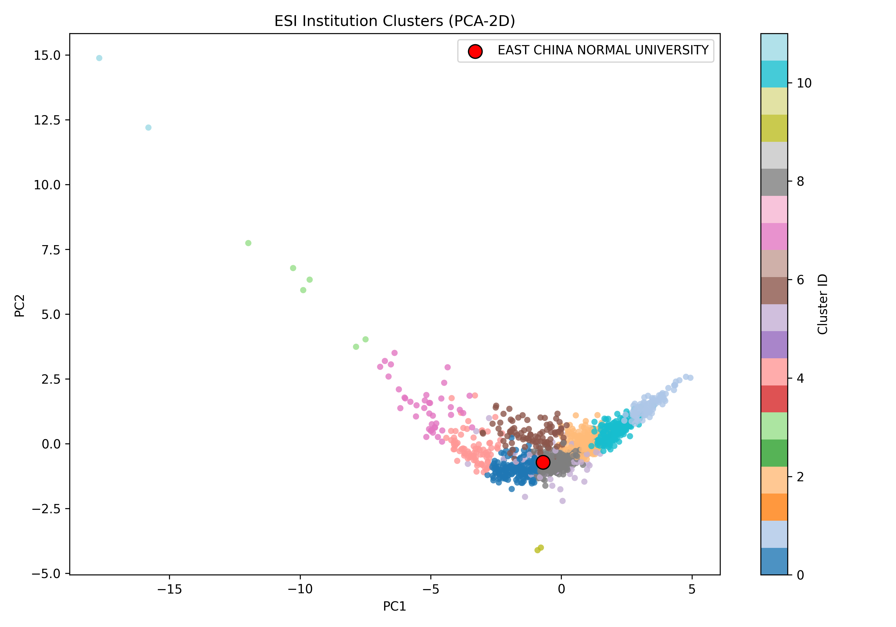

# 课程实验报告

本次实验主要是用 Python 做一个科研机构排名预测与聚类分析。  
我从助教提供的 ESI 上 22 个学科 CSV 文件出发，先把数据清洗成统一结构的 JSON，  
再用一个包含嵌入层与残差结构的神经网络模型进行排名预测，  
最后根据机构的统计特征做聚类分析，看看哪些高校在科研表现上最相似。结果表明模型在验证集上达到 6.35% 的 MAPE，能较好捕捉机构间的科研水平差异。
整个项目包含数据处理、模型训练、结果推理和聚类可视化四个部分，所有脚本都能直接通过 `uv run` 运行。

## 项目运行与环境

在首次运行前，请在项目根目录执行：

```bash
uv sync
```

1. **数据清洗与导出**
```bash
uv run scripts/export_data.py
```

将 `download/` 目录中的 CSV 文件清洗并导出为统一格式的 JSON。

2. **模型训练**

```bash
uv run scripts/train_ranking.py --epochs 60 --batch-size 512 --lr 3e-4 --seed 42
```

使用清洗后的数据训练 `RankingNet` 模型，生成权重与指标日志。

3. **模型推理**

```bash
uv run scripts/predict_rank.py --institution "EAST CHINA NORMAL UNIVERSITY" --sample-rows 5
```

载入已训练模型，对指定院校的学科记录进行排名预测。

4. **聚类分析**

```bash
uv run scripts/cluster_institutions.py --n-clusters 12 --min-disciplines 8 --top-k 12
```

基于机构统计特征进行 KMeans 聚类，输出相似院校名单与散点图。


## 一：数据清洗与 JSON 导出

原始 ESI CSV 使用 `latin1` 编码，首行是说明文字，数值字段伴随引号和千分位逗号。如果脚本分别解析这些文件，很容易出现列名不一致、类型转换失败等问题。为了让训练、聚类与推理共享同一份数据，我需要构建统一的清洗流程，并将结果导出为结构化 JSON。

### 我的实现
`src/data_processing.py` 负责全部清洗步骤：
- `_load_single_csv` 跳过说明行、标准化列名、去除引号/逗号并将 `Rank`、`Documents`、`Citations`、`CitationsPerPaper`、`TopPapers` 转换为浮点；
- `load_datasets` 遍历 22 个 CSV、拼接为单一 `DataFrame`，最终得到 34,121 条学科记录；
- `summarise_by_institution` 以机构为键计算平均值、最佳排名、中位排名和参与学科数量；
- `load_datasets_from_json` 则让后续脚本直接读取我导出的 JSON。

```python
# src/data_processing.py
def load_datasets(data_dir: Path) -> pd.DataFrame:
    entries = [DisciplineDataset(csv_path.stem, csv_path)
               for csv_path in sorted(data_dir.glob("*.csv"))
               if not csv_path.name.lower().startswith(".~")]
    frames = [_load_single_csv(entry) for entry in entries]
    combined = pd.concat(frames, ignore_index=True, sort=False)
    desired = ["Discipline", "Institution", "Country", "Rank",
               "Documents", "Citations", "CitationsPerPaper", "TopPapers"]
    combined = combined[[col for col in desired if col in combined.columns]]
    return combined.dropna(subset=["Rank"]).reset_index(drop=True)
```

`export_data.py` 的职责是把上述 `DataFrame` 固定到文件系统：

```python
# scripts/export_data.py
@app.command()
def main(...):
    df = load_datasets(data_dir)
    summary = summarise_by_institution(df)
    df.to_json(cleaned_path, orient="records", indent=2, force_ascii=False)
    summary.to_json(summary_path, orient="records", indent=2, force_ascii=False)
    json.dump({
        "record_count": int(len(df)),
        "discipline_count": int(df["Discipline"].nunique()),
        "institution_count": int(df["Institution"].nunique()),
        "fields": df.columns.tolist(),
    }, cleaned_path.with_suffix(".meta.json").open("w", encoding="utf-8"), indent=2, ensure_ascii=False)
```

运行后得到：
- `data/cleaned_records.json`：逐学科记录（行级数据）
- `data/institution_summary.json`：机构级统计
- `data/cleaned_records.meta.json`：记录数、学科数、机构数与字段名



## 二：模型输入、输出与网络结构

这一部分主要介绍我设计的模型结构和输入输出的组织方式。  
我没有直接把所有数值丢进网络，而是把数值特征标准化后再经过一层线性投影，  
同时把学科、国家和机构等类别特征用嵌入层映射成向量表示，然后把它们拼接在一起输入神经网络。  
模型整体采用了带有交叉层（CrossFeatureBlock）和残差门控块（ResidualGatedBlock）的结构，  
用于同时捕捉不同特征之间的乘性交互和非线性关系，最后通过回归头输出预测的排名值。

### Pipeline


- 数值特征（4 维）：`Documents`、`Citations`、`CitationsPerPaper`、`TopPapers`
- 类别特征（3 列）：`Discipline`（23 类）、`Country`（134 类）、`Institution`（7556 类）
- 每条输入记录经过编码后得到：
  - 标准化数值向量：形状 `(4,)`
  - 嵌入向量：`18 + 27 + 64 = 109` 维
  - 拼接后特征维度：`32 + 109 = 141`（32 来自数值投影，见下文）
  - 训练目标：`log1p(Rank)`，标量

### 输入/输出含义
- **输入张量**
  - `numeric`: `(batch_size, 4)` 的 float32 张量，已经过标准化
  - `categorical`: `(batch_size, 3)` 的 int64 张量，分别对应学科、国家、机构的索引
- **输出张量**
  - `pred_log_rank`: `(batch_size, 1)`，模型在 log 空间的预测值
  - 使用 `torch.expm1(pred_log_rank)` 得到实际排名预测

这些编码与映射由 `RankingDataModule` 提供，并通过 `RankingEncoderState` 序列化保存在模型 checkpoint 中。

## 三：RankingDataModule 与编码器状态

`src/ranking_data.py` 负责数据集拆分、标准化与类别编码：
- `setup` 按 60% / 20% / 20% 划分样本，保证随机但可复现（种子 42）；
- `get_state` 与 `RankingEncoderState.from_dict` 让训练脚本在保存模型时同时保存编码器参数；
- `RankingEncoder` 在推理阶段重新构建 `StandardScaler` 与类别映射。

```python
# src/ranking_data.py
@dataclass
class RankingEncoderState:
    numeric_cols: List[str]
    categorical_cols: List[str]
    target_col: str
    scaler_mean: List[float]
    scaler_scale: List[float]
    category_maps: Dict[str, Dict[str, int]]
    category_cardinalities: Dict[str, int]

class RankingDataModule:
    def encode_features(self, df: pd.DataFrame) -> Dict[str, torch.Tensor]:
        numeric_array = self.scaler.transform(df[self.numeric_cols])
        numeric_tensor = torch.tensor(numeric_array, dtype=torch.float32)
        categorical_arrays = []
        for col in self.categorical_cols:
            mapping = self.category_maps[col]
            encoded = df[col].fillna("<UNK>").astype(str)
            categorical_arrays.append(encoded.map(lambda v: mapping.get(v, 0)).to_numpy())
        categorical_tensor = torch.tensor(np.stack(categorical_arrays, axis=1), dtype=torch.long)
        return {"numeric": numeric_tensor, "categorical": categorical_tensor}
```

保存的 `models/ranking_model.pt` 中包含：
- `model_state_dict`
- `embedding_info`: `[(23, 18), (134, 27), (7556, 64)]`
- `data_state`: 标准化均值/方差与类别索引映射
- `model_config`: `hidden_dim=192`、`num_residual_blocks=4`、`cross_layers=2`、`dropout=0.2`
- `split_sizes`: `{train: 20472, validation: 6824, test: 6825}`

## 四：训练脚本 `scripts/train_ranking.py`

### 参数说明
| 参数 | 默认值 | 作用 |
|------|--------|------|
| `--data-json` | `data/cleaned_records.json`（若不存在则读取 `download/`） | 指定训练数据来源，方便直接使用导出的 JSON |
| `--data-dir` | `download` | 当 `--data-json` 未提供或文件缺失时，直接解析原始 CSV |
| `--epochs` | 40（示例命令使用 60） | 训练轮数，同时影响余弦退火调度 `T_max` |
| `--batch-size` | 512 | DataLoader 批大小，影响吞吐和显存使用 |
| `--lr` | 3e-4 | AdamW 学习率 |
| `--seed` | 42 | 控制数据拆分与权重初始化，确保可复现 |
| `--model-path` | `models/ranking_model.pt` | 模型权重与编码状态的保存路径 |
| `--metrics-path` | `logs/ranking_metrics.json` | 训练结束后的指标输出 |



训练完成后，`logs/ranking_metrics.json` 中记录：
```json
{
  "train": {"mse": 21404.658203125, "mape": "4.5373%"},
  "validation": {"mse": 25700.65234375, "mape": "6.3560%"},
  "test": {"mse": 25753.033203125, "mape": "6.8779%"},
  "epochs": 60,
  "split_sizes": {"train": 20472, "validation": 6824, "test": 6825},
  "model_config": {"hidden_dim": 192, "num_residual_blocks": 4, "cross_layers": 2, "dropout": 0.2}
}
```

## 五：推理脚本 `scripts/predict_rank.py`

### 参数说明
| 参数 | 默认值 | 作用 |
|------|--------|------|
| `--model-path` | `models/ranking_model.pt` | 读取训练好的模型与编码器状态 |
| `--data-json` | `data/cleaned_records.json` | 推理所用的行级数据 |
| `--institution/-i` | 可重复 | 指定一个或多个院校筛选记录 |
| `--discipline` | `None` | 进一步限定学科 |
| `--record-json` | `None` | 直接提供一批自定义记录（需包含全部特征列） |
| `--sample-rows` | 10 | 当未指定 `record_json` 时，从筛选结果中随机抽样展示的条目数 |
| `--output-path` | `logs/predicted_ranks.json` | 存储预测结果与误差统计 |

### 示例输出
执行 `uv run scripts/predict_rank.py --institution "EAST CHINA NORMAL UNIVERSITY"` 可以看到如下终端输出与完整预测结果。

最关键的是最后三列：predictedRank 列为预测结果，Rank 列为ground truth，最后一列 AbsoluteError 表示预测误差。





我利用脚本生成了下图，展示真实排名与预测排名的对比（横轴为学科）：



`logs/predicted_ranks.json` 的结构如下，便于进一步绘图或统计：
```json
{
  "generated_at": "2025-11-03T11:22:45.123Z",
  "filters": {"institutions": ["EAST CHINA NORMAL UNIVERSITY"], "sample_rows": 5},
  "stats": {"count": 5, "mse": 4040.15, "mae": 41.19, "mape": 6.8},
  "records": [...]
}
```


## 六：聚类脚本 `scripts/cluster_institutions.py`

这一部分主要是根据各机构在不同学科的平均表现，分析它们之间的相似程度。  
我先利用 `export_data.py` 导出的 `institution_summary.json`，提取每个机构的综合指标（平均排名、最佳排名、中位排名、文献量、引用数、Top 论文数、学科覆盖数等），标准化后用 KMeans 进行聚类。这样可以让科研规模和学科结构相似的高校自动分到同一簇中。

### 流程
- 基于 `data/institution_summary.json` 构建 8 维特征（平均/最佳/中位排名 + 文献量/引用 + Top 论文数 + 学科覆盖数），使用 `StandardScaler` 标准化；
- 采用 `KMeans(n_clusters=12, n_init=20)` 聚类，记录每个机构的簇编号与中心距离；
- 输出两份 JSON：
  - `logs/cluster_similar_ecnu.json`：目标高校所在簇的详细名单（已按与目标高校的距离排序）；
  - `logs/cluster_assignments.json`：全量机构的簇分配与中心距离；
- 利用 PCA 将 8 维特征降到 2 维并绘制散点，红色点标记华东师大。

### 参数说明
| 参数 | 默认值 | 作用 |
|------|--------|------|
| `--n-clusters` | 12 | 聚类簇数量，影响 granularity |
| `--min-disciplines` | 5 | 过滤参与学科过少的机构，避免噪声 |
| `--top-k` | 10 | `cluster_similar_ecnu.json` 中展示的最近同行数量 |
| `--target-institution` | "EAST CHINA NORMAL UNIVERSITY" | 目标院校 |
| `--output-path` | `logs/cluster_similar_ecnu.json` | 目标簇输出 |
| `--assignments-path` | `logs/cluster_assignments.json` | 全量分配输出 |
| `--figure-path` | `pictures/cluster-scatter.png` | PCA 可视化路径 |

### 输出

运行命令：
```bash
uv run scripts/cluster_institutions.py --n-clusters 12 --min-disciplines 8 --top-k 12
```

终端输出如下：


从聚类结果可以看出，**华东师范大学（EAST CHINA NORMAL UNIVERSITY）** 被分到第 8 个簇，  
与之最相似的高校包括 **University of Quebec（加拿大）**、**Cairo University（埃及）**、  
**Kyung Hee University（韩国）**、**University of Wollongong（澳大利亚）** 等。  
这些学校在学科覆盖度（约 16–18 个学科）和平均排名（约 500–600 区间）上与华师大接近，  
说明它们在科研规模和整体学科实力上处于相似水平。  



图中每个点代表一所机构，颜色区分簇编号，红色圆点是华师大。`logs/cluster_assignments.json` 内含 `center_distance` 字段，可用于进一步排名同簇院校。

## 七、数据文件列表

| 路径 | 说明 |
|------|------|
| `data/cleaned_records.json` | 34,121 条清洗后的学科记录（模型训练与推理的数据源） |
| `data/institution_summary.json` | 1,324 所机构的均值/最佳/中位排名与学科覆盖度 |
| `models/ranking_model.pt` | 包含模型权重、嵌入规格、编码器状态、模型配置、数据来源 |
| `logs/ranking_metrics.json` | 训练/验证/测试指标与超参数 |
| `logs/predicted_ranks.json` | 推理示例记录与误差统计 |
| `logs/cluster_similar_ecnu.json` | 与目标院校最接近的同行名单 |
| `logs/cluster_assignments.json` | 全量聚类分配（簇编号、中心距离） |
