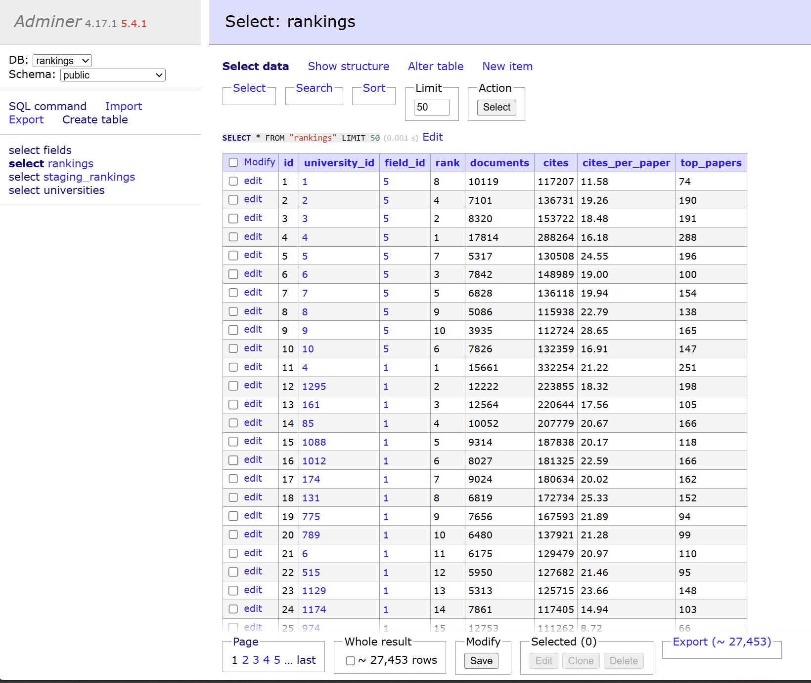

# Lab4: 全球大学排名数据 SQL 分析作业

这次作业主要是用 SQL 分析全球大学在不同学科中的表现。我在 Lab3 里本来是从 ESI 网站爬了各学科的排名数据，但为了统一标准，最后还是用了群里老师提供的文件作为本次作业的源数据。

---

## 一、数据获取和处理

### 爬取数据
这次用的是群里分享的解压后的 zip 文件，每个学科对应一个 CSV 文件，里面包含了排名、机构名称、国家/地区、论文数量、引用次数等信息。原始数据大概长这样：

```
Indicators Results List: Institutions   Filter Results By: ResearchFields   Filter Value(s): COMPUTER SCIENCE   Show: Top
,Institutions,Countries/Regions,Web of Science Documents,Cites,Cites/Paper,Top Papers
"1","CHINESE ACADEMY OF SCIENCES","CHINA MAINLAND","17814","288264","16.18","288"
"2","TSINGHUA UNIVERSITY","CHINA MAINLAND","8320","153722","18.48","191"
...
Copyright © 2025 Clarivate
```

### 数据清理工作
原始 CSV 文件有很多问题需要处理。我发现第一行是描述信息，第二行是列标题，这两行都不能直接导入数据库。文件末尾还有版权声明，这些都需要清理掉。

我写了一个处理流程来解决这个问题。首先是跳过前两行，用的是 Linux 的 `tail -n +3` 命令，这个命令会从第三行开始显示内容。然后删除版权行和空行，用 `sed '/^Copyright/d'` 和 `sed '/^\s*$/d'` 来处理。

还有一个问题是数据字段都被双引号包围，比如 `"1","CHINESE ACADEMY OF SCIENCES","CHINA MAINLAND"`。如果直接导入数据库会有问题，所以我在 PostgreSQL 里用了 `WITH CSV QUOTE '"'` 参数来正确处理这些引号。


---

## 二、数据库设计

一开始我考虑把所有数据放在一张表里，但后来问了下AI，意识到同一个大学会在多个学科中出现，这样会导致大量重复数据。所以我决定用规范化的三表设计。

第一张表是 `universities`，存储大学的基本信息：
```sql
CREATE TABLE universities (
    id SERIAL PRIMARY KEY,
    name VARCHAR(255) UNIQUE NOT NULL,
    country VARCHAR(100) NOT NULL
);
```

第二张表是 `fields`，存储学科信息：
```sql
CREATE TABLE fields (
    id SERIAL PRIMARY KEY,
    name VARCHAR(100) UNIQUE NOT NULL
);
```

第三张表是 `rankings`，存储具体的排名数据：
```sql
CREATE TABLE rankings (
    id SERIAL PRIMARY KEY,
    university_id INTEGER REFERENCES universities(id),
    field_id INTEGER REFERENCES fields(id),
    rank INTEGER NOT NULL,
    documents INTEGER,
    cites INTEGER,
    cites_per_paper DECIMAL(10,2),
    top_papers INTEGER,
    UNIQUE(university_id, field_id)
);
```

我还创建了一些索引来提高查询性能，比如 `CREATE INDEX idx_university_country ON universities(country);` 和 `CREATE INDEX idx_rankings_university ON rankings(university_id);`


---

## 三、数据导入过程

数据导入是整个作业中最复杂的部分。我分了好几个步骤来完成。

### 创建暂存表

因为原始 CSV 文件格式比较复杂，我决定先创建一个暂存表来接收原始数据：
```sql
CREATE TABLE staging_rankings (
    rank_col VARCHAR(255),
    institution VARCHAR(255),
    country_region VARCHAR(255),
    documents VARCHAR(255),
    cites VARCHAR(255),
    cites_per_paper VARCHAR(255),
    top_papers VARCHAR(255)
);
```

这里我用 VARCHAR 类型是因为 CSV 里的数字都被引号包围，需要先作为文本导入，后面再转换。

### 导入学科数据

这个比较简单，我先手动把 22 个学科插入到 fields 表：
```sql
INSERT INTO fields (name) VALUES
('AGRICULTURAL SCIENCES'),
('BIOLOGY & BIOCHEMISTRY'),
('CHEMISTRY'),
...
('SPACE SCIENCE');
```

### 处理 CSV 文件导入

对于每个 CSV 文件，我都按照这个流程处理：

首先把文件复制到 Docker 容器里：
```bash
docker cp "download/COMPUTER SCIENCE.csv" "lab4-postgres:/tmp/COMPUTER SCIENCE.csv"
```

然后在容器内处理数据：
```bash
tail -n +3 '/tmp/COMPUTER SCIENCE.csv' | \
sed '/^Copyright/d' | \
sed '/^\s*$/d' > '/tmp/clean_COMPUTER SCIENCE.csv'
```

最后用 `\copy` 命令导入：
```sql
\copy staging_rankings FROM '/tmp/clean_COMPUTER SCIENCE.csv' WITH CSV QUOTE '"' ENCODING 'UTF-8';
```

### 迁移到正式表

数据导入到暂存表后，我需要把数据迁移到正式的表中。

首先导入大学信息：
```sql
INSERT INTO universities (name, country)
SELECT DISTINCT institution, country_region
FROM staging_rankings
WHERE institution IS NOT NULL AND institution != ''
ON CONFLICT (name) DO NOTHING;
```

这里用 `ON CONFLICT (name) DO NOTHING` ，因为同一个大学会在多个学科的 CSV 文件中出现，这样可以避免重复插入。

然后导入排名数据：
```sql
INSERT INTO rankings (university_id, field_id, rank, documents, cites, cites_per_paper, top_papers)
SELECT
    u.id,
    5,  -- 计算机科学的 field_id
    rank_col::INTEGER,
    documents::INTEGER,
    cites::INTEGER,
    cites_per_paper::DECIMAL(10,2),
    top_papers::INTEGER
FROM staging_rankings s
JOIN universities u ON u.name = s.institution;
```

这里我用了类型转换 `::INTEGER` 和 `::DECIMAL(10,2)`，因为暂存表里存的是文本格式，需要转换成数字。



我写了一个脚本来自动处理所有 22 个 CSV 文件，每个文件都重复上述流程。最后导入完成后，数据库里总共有 22 个学科、5,362 所大学、27,453 条排名记录。

总的来说，对于每个 CSV 文件，我都执行了以下处理步骤：

1. 复制文件到 Docker 容器
2. 跳过前两行（描述和标题）
3. 删除版权声明和空行
4. 导入到暂存表
5. 迁移到正式表

---

## 四、SQL 查询分析

数据导入完成后，我开始进行各种查询分析。

### 1. 华东师范大学在各学科的表现（任务5）

我先用一个简单的查询来看看华东师范大学在哪些学科有排名：
```sql
SELECT f.name as field_name, r.rank, r.cites
FROM rankings r
JOIN universities u ON r.university_id = u.id
JOIN fields f ON r.field_id = f.id
WHERE u.name = 'EAST CHINA NORMAL UNIVERSITY'
ORDER BY r.rank;
```

这个查询通过三个表的 JOIN 来获取完整信息，`WHERE u.name = 'EAST CHINA NORMAL UNIVERSITY'` 确保只查询华东师范大学的数据，`ORDER BY r.rank` 让结果按排名排序。


从结果看，华东师范大学在 16 个学科中都有排名。表现最好的是化学学科，排第 90 名；数学排第 115 名，环境生态排第 130 名。临床医学排名比较靠后，第 2852 名，可能还需要加强建设。

### 2. 中国大陆大学的整体表现（任务6）

接下来我想看看中国大陆大学在各个学科的整体表现：
```sql
SELECT
    f.name as field_name,
    COUNT(*) as university_count,
    MIN(r.rank) as best_rank,
    AVG(r.rank) as average_rank,
    MAX(r.rank) as worst_rank,
    SUM(r.cites) as total_cites
FROM rankings r
JOIN universities u ON r.university_id = u.id
JOIN fields f ON r.field_id = f.id
WHERE u.country = 'CHINA MAINLAND'
GROUP BY f.name
ORDER BY f.name;
```

这个查询用了多个聚合函数：`COUNT(*)` 统计大学数量，`MIN()` 和 `MAX()` 找出最佳和最差排名，`AVG()` 计算平均排名，`SUM()` 计算总引用数。`GROUP BY f.name` 按学科分组统计。


结果非常amazing。工程学最多，有 534 所中国大学上榜；计算机科学表现最强，平均排名只有 3.6，前 5 名全是中国大学；化学的总引用数最多，达到 3000 多万次。中国大学在所有 22 个学科中都有参与，覆盖面很广。

### 3. 全球各地区的学科优势分析（任务7）

最后我想分析全球不同地区的学术格局。我先做了一个基础分析：
```sql
SELECT
    f.name as field_name,
    u.country,
    COUNT(*) as university_count,
    AVG(r.rank) as average_rank,
    MIN(r.rank) as best_rank,
    MAX(r.cites) as max_cites,
    AVG(r.cites_per_paper) as avg_cites_per_paper
FROM rankings r
JOIN universities u ON r.university_id = u.id
JOIN fields f ON r.field_id = f.id
GROUP BY f.name, u.country
HAVING COUNT(*) >= 10
ORDER BY f.name, average_rank;
```

这里我用 `HAVING COUNT(*) >= 10` 来确保只显示在该领域有足够样本量的地区，避免偶然性。


为了让结果更清晰，我又写了一个更复杂的查询，只显示每个学科表现最好的前 5 个地区：
```sql
WITH regional_performance AS (
    SELECT
        f.name as field_name,
        u.country,
        COUNT(*) as university_count,
        AVG(r.rank) as avg_rank,
        MIN(r.rank) as best_rank,
        MAX(r.cites) as max_cites,
        AVG(r.cites_per_paper) as avg_cites_per_paper,
        ROW_NUMBER() OVER (PARTITION BY f.name ORDER BY AVG(r.rank) ASC) as rank_in_field
    FROM rankings r
    JOIN universities u ON r.university_id = u.id
    JOIN fields f ON r.field_id = f.id
    GROUP BY f.name, u.country
    HAVING COUNT(*) >= 5
)
SELECT
    field_name,
    country,
    university_count,
    ROUND(avg_rank::NUMERIC, 1) as avg_rank,
    best_rank,
    avg_cites_per_paper
FROM regional_performance
WHERE rank_in_field <= 5
ORDER BY field_name, rank_in_field;
```

这个查询用了窗口函数 `ROW_NUMBER() OVER (PARTITION BY f.name ORDER BY AVG(r.rank) ASC)` 来为每个学科的地区表现排名，然后用 CTE 来提高查询的可读性。


从分析结果可以看到一些规律。计算机科学方面，中国大陆有绝对优势，前 5 名全是中国大学。数学方面，法国、美国、英国表现最好。材料科学方面，香港、新加坡、澳大利亚排名靠前。基础科学领域，欧洲国家表现稳定。医学领域，美国保持领先。

---

## 五、补充说明

### 文件结构

我按照功能把 SQL 语句分成了不同的文件：

* `create_tables.sql` - 创建表结构
* `insert_fields.sql` - 插入学科数据
* `create_staging_table.sql` - 创建暂存表
* `migrate_universities.sql` - 迁移大学数据
* `migrate_rankings.sql` - 迁移排名数据
* `query_ecnu_rankings.sql` - 查询华东师范大学排名
* `query_china_performance.sql` - 查询中国大学表现
* `query_global_analysis.sql` - 全球分析基础查询
* `query_top_regions.sql` - 全球分析进阶查询
* `verification_queries.sql` - 数据验证查询
* `docker-compose.yml` - 定义 PostgreSQL 容器环境，包含数据库配置与端口映射
* `import_data.sh` - 自动化脚本，用于批量清洗并导入 22 个学科的 CSV 数据
